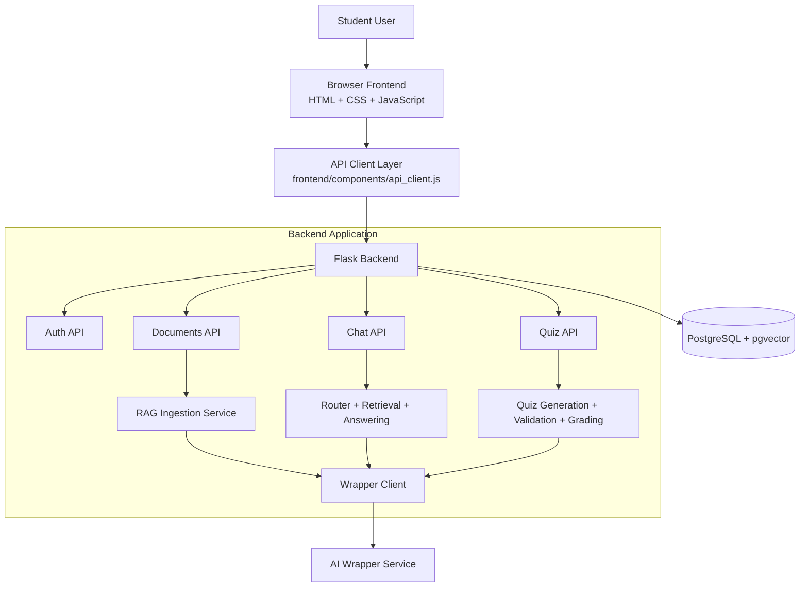
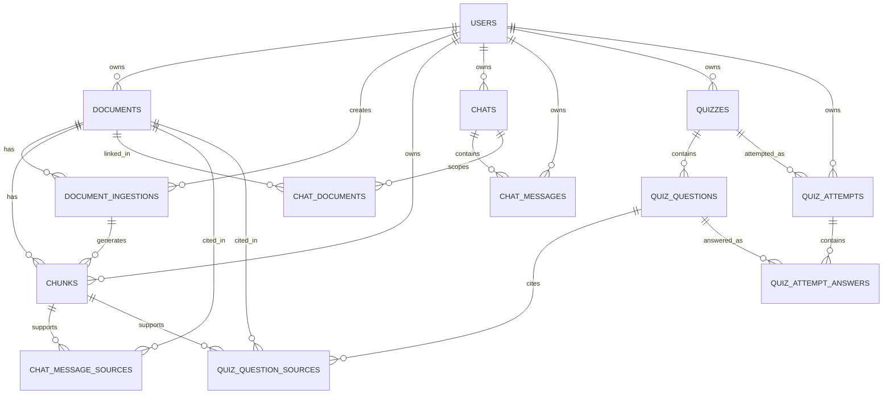
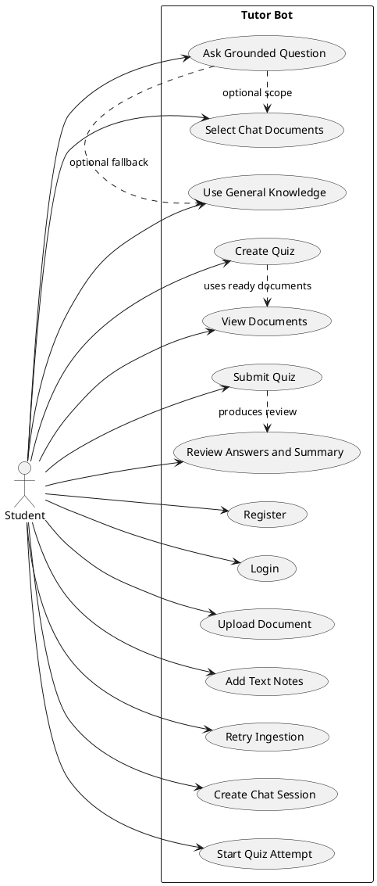
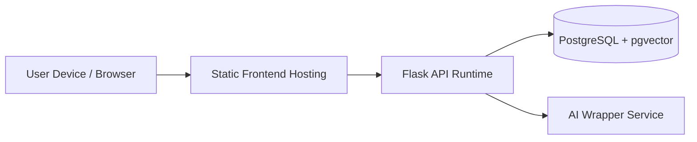
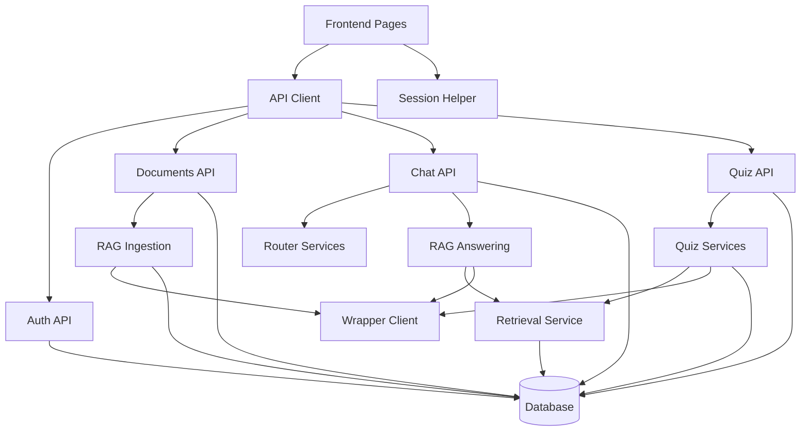

# Tutor Bot Project Report

Sections intentionally omitted as requested:
- Certificate
- Acknowledgement

Project Title: Tutor Bot  
Project Type: AI-enabled academic study assistant  
Technology Domain: Web application, Retrieval Augmented Generation (RAG), quiz generation, user-scoped learning workspace

Diagram generation note:
- Mermaid code blocks can be pasted into `https://mermaid.live/`
- PlantUML code blocks can be pasted into `https://www.plantuml.com/plantuml/uml/`

---

## Executive Summary

### Purpose

Tutor Bot is a personal AI study workspace designed to help students learn from their own study materials. The system allows a user to upload PDF or text-based study documents, chat against those documents using Retrieval Augmented Generation, and generate quizzes from the same study material inside one authenticated application.

The purpose of Tutor Bot is to reduce the friction students face when moving between notes, search tools, chat tools, and self-testing tools. Instead of manually switching between multiple platforms, the student can manage study documents, ask contextual questions, and practice with generated quizzes inside one product.

### Problem or Opportunity Statement

Students often have study material in fragmented forms such as PDF notes, lecture summaries, markdown notes, and copied text. Traditional study workflows create multiple challenges:

- students spend time searching through long documents to find answers
- generic AI tools may answer from broad knowledge instead of the student's actual syllabus
- there is no seamless path from reading notes to asking questions to taking quizzes
- self-evaluation is usually manual and inconsistent

This creates an opportunity for a document-grounded tutor system that responds based on the student's own uploaded content and turns the same content into structured quiz practice.

### Objectives / Requirement Analysis

The major objectives of Tutor Bot are:

1. Provide secure user authentication and isolation of user data.
2. Allow users to upload PDFs, text files, markdown files, and plain text study notes.
3. Ingest document content into a retrievable format using text chunking and vector embeddings.
4. Support contextual chat where answers are grounded in the user's uploaded documents.
5. Show citations so the student can trace the answer back to the supporting source.
6. Allow document scoping per chat so a single conversation can focus on selected study material only.
7. Detect when the uploaded documents do not contain the requested answer and let the user explicitly choose whether to use general knowledge.
8. Generate quizzes from the user's ready documents or selected documents only.
9. Allow quiz attempts, grading, answer review, and performance summaries.
10. Keep all frontend API communication centralized through a single client layer and all backend AI communication centralized through a single wrapper client layer.

### Proposed Solution with Scope

Tutor Bot is implemented as a full-stack web application with:

- a static frontend built in HTML, CSS, and JavaScript
- a Flask backend exposing REST APIs
- PostgreSQL with pgvector for persistent storage and similarity search
- an AI wrapper service used for chat completions and embeddings

Current in-scope features:

- JWT auth with register, login, refresh, and me
- document upload for PDF, TXT, and MD files
- plain text note ingestion
- ingestion status tracking and retry
- soft delete for documents
- RAG-based chat with citations
- per-chat document selection
- out-of-context handling with optional general knowledge retry
- quiz generation from all ready or selected ready documents
- quiz attempts, grading, explanations, and summaries

Current out-of-scope or pending items:

- analytics dashboard and analytics APIs
- asynchronous background ingestion workers
- streaming chat responses
- full CI/CD pipeline and production hardening

### Value Proposition

Tutor Bot creates value in the following ways:

- It keeps answers grounded in the student's own material rather than relying only on broad model knowledge.
- It reduces study time spent on manual document searching.
- It improves understanding through conversational clarification with citations.
- It converts passive reading into active recall through quiz generation.
- It keeps all actions user-scoped, which is important for privacy and clean multi-user separation.

### Recommendations

Recommended next improvements are:

1. Implement analytics APIs and frontend dashboards for study progress visibility.
2. Move ingestion from request-time processing to background workers.
3. Add browser-based end-to-end tests and CI automation.
4. Add production deployment hardening, logging, monitoring, and observability.
5. Add richer content extraction support for scanned PDFs and OCR-heavy material.

### Conclusion

Tutor Bot successfully demonstrates a practical AI-supported study platform built around user-owned documents. The current implementation already supports the core academic workflow of upload -> understand -> ask -> revise -> test. The system architecture is modular, scalable in design, and ready for future expansion into analytics and more advanced learning support.

---

## Project Estimate

This estimate is prepared for academic reporting purposes based on the implemented project scope. It assumes a small student team working over approximately 8 weeks.

### Effort Estimate

| Phase | Activities | Estimated Hours |
| --- | --- | ---: |
| Requirement Analysis | problem study, feature definition, flow planning | 18 |
| System Design | architecture, API planning, schema design, UI structure | 26 |
| Environment Setup | backend setup, database setup, wrapper configuration, frontend structure | 14 |
| Authentication Module | register, login, refresh, me, session handling | 18 |
| Document Module | upload, text note input, ingestion status, soft delete, retry | 26 |
| RAG Chat Module | chunking, embeddings, retrieval, grounded answer generation, citations | 34 |
| Chat Scope and OOC Handling | per-chat document selection, out-of-context choice flow | 18 |
| Quiz Module | schema, generation, validation, attempts, grading, summary | 34 |
| Frontend Integration | multi-page UI, API client, auth guards, page controllers | 30 |
| Testing and Documentation | integration tests, README updates, report preparation | 22 |
| Total |  | 240 |

### Resource Estimate

Suggested team composition for this scope:

- 1 backend-focused developer
- 1 frontend-focused developer
- 1 full-stack / QA / documentation contributor

### Risk Estimate

Major effort risks:

- external AI wrapper latency or failure
- PDF extraction quality for complex or scanned files
- synchronous ingestion increasing request duration
- quiz generation requiring validation and repair loops

---

## Project Design

### Logical Design

The logical design of Tutor Bot is centered on five major business flows:

1. User Authentication
   - A user registers, logs in, refreshes tokens, and accesses protected resources.
2. Document Management
   - A user uploads a file or enters plain text.
   - The system stores a document record, creates an ingestion record, extracts text, chunks content, generates embeddings, and stores vectorized chunks.
3. Contextual Chat
   - The user creates or selects a chat session.
   - The system retrieves relevant chunks from the user's document set and sends context plus history to the AI wrapper.
   - The answer is stored along with source references.
4. Scoped Study Interaction
   - A user can pin selected documents to a chat session to narrow the retrieval scope.
5. Quiz Creation and Attempt Flow
   - A user creates a quiz from the available ready documents.
   - The system retrieves grounded content, generates structured quiz JSON, validates it, stores the quiz, and enables attempts and grading.

### System Architecture

Tutor Bot follows a layered architecture:

- Presentation Layer: static browser frontend
- API Layer: Flask route blueprints
- Service Layer: wrapper, RAG, router, and quiz services
- Data Layer: PostgreSQL + pgvector
- External AI Layer: wrapper service for chat completions and embeddings

#### System Architecture Diagram Code



---

## Entity Relationship Diagram

The database is designed around user-scoped content. Every major object belongs to a user either directly or through a parent entity. Documents are versioned through ingestions, and retrieval works only on the document's current ingestion. Chat and quiz records reference grounded chunk sources for traceability.

### ER Diagram Code



### Main Entities

| Entity | Purpose |
| --- | --- |
| `users` | stores registered user records |
| `documents` | stores document metadata and active ingestion pointer |
| `document_ingestions` | stores ingestion runs and status |
| `chunks` | stores chunk text and embeddings for retrieval |
| `chats` | stores chat sessions |
| `chat_messages` | stores user and assistant messages |
| `chat_message_sources` | stores grounded chunk citations for assistant messages |
| `chat_documents` | stores per-chat document scope |
| `quizzes` | stores generated quizzes |
| `quiz_questions` | stores quiz questions and answer keys |
| `quiz_question_sources` | stores grounded chunk citations for quiz questions |
| `quiz_attempts` | stores quiz attempt sessions |
| `quiz_attempt_answers` | stores submitted answers and awarded marks |

---

## Use Case Diagram

The main actor is the student user. The system supports learning, questioning, document management, and self-assessment inside one authenticated workspace.

### Use Case Diagram Code



### Use Cases

| Use Case | Description |
| --- | --- |
| Register / Login | user obtains authenticated access to the workspace |
| Upload Document | user uploads PDF, TXT, or MD file |
| Add Text Notes | user directly pastes study notes |
| Ask Grounded Question | user asks questions answered from uploaded material |
| Select Chat Documents | user narrows retrieval to selected documents |
| Use General Knowledge | user explicitly requests a non-grounded answer if needed |
| Create Quiz | user generates a quiz from ready study material |
| Start and Submit Attempt | user answers quiz questions and receives marks |
| Review Summary | user sees explanations, correct answers, and performance summary |

---

## Assumptions and Dependencies

### Assumptions

1. The user has valid study material in PDF or text form.
2. PostgreSQL is available and the `pgvector` extension can be enabled.
3. The AI wrapper service is available through configured environment variables.
4. The uploaded PDF contains extractable text. Scanned image-only PDFs are outside the reliable extraction path.
5. Users interact through a modern browser with JavaScript enabled.

### Dependencies

Backend dependencies:

- Python
- Flask
- Flask-SQLAlchemy
- Flask-Migrate
- Flask-JWT-Extended
- requests
- pdfplumber
- pgvector

Frontend dependencies:

- vanilla HTML, CSS, and JavaScript
- marked (for assistant markdown rendering)
- Google Fonts (DM Sans and Sora)

Operational dependencies:

- `DATABASE_URL`
- `SECRET_KEY`
- `JWT_SECRET_KEY`
- `WRAPPER_BASE_URL`
- `WRAPPER_KEY`
- `CORS_ALLOWED_ORIGINS`
- frontend `API_BASE_URL`

---

## Physical Design

### Overall System Design

The physical design uses a browser-based client and a server-side API. The backend may run locally or behind serverless-style deployment configuration. Data is stored in PostgreSQL with vector search support. AI requests are not sent directly from the frontend; they always pass through the backend wrapper client.

Deployment characteristics:

- Frontend: static pages served over HTTP
- Backend: Flask application with REST endpoints
- Database: PostgreSQL with pgvector
- External service: AI wrapper endpoint

### Physical Design Diagram Code



### Deployment Notes

- The repository includes `backend/vercel.json` for Python backend deployment routing.
- The repository includes `frontend/vercel.json` for frontend deployment configuration.
- For local development, the frontend is served with `python -m http.server 5500` and the backend runs on port `5000`.

---

## Data Design / Modeling

### Data Modeling Principles

The schema follows these principles:

1. User scope is enforced at the data level wherever practical.
2. Grounding traceability is stored explicitly through source association tables.
3. Document ingestion history is preserved separately from the current active ingestion.
4. Quiz attempts are stored independently so users can retake quizzes.
5. Vectorized chunks are isolated from raw documents to support efficient retrieval.

### Core Relationships

- One user can have many documents.
- One document can have many ingestions.
- One ingestion can produce many chunks.
- One user can have many chats.
- One chat can have many messages.
- One chat can be linked to many documents through `chat_documents`.
- One quiz can have many questions and many attempts.
- One question can cite many chunks.
- One attempt can store many answer rows.

### Important Fields

| Table | Important Fields |
| --- | --- |
| `users` | `email`, `username`, `password_hash`, `is_active` |
| `documents` | `title`, `source_type`, `filename`, `is_deleted`, `current_ingestion_id` |
| `document_ingestions` | `source_type`, `status`, `error_message`, `completed_at` |
| `chunks` | `chunk_index`, `page_start`, `page_end`, `content`, `embedding` |
| `chat_messages` | `role`, `content`, `model_used`, `router_json` |
| `quizzes` | `title`, `instructions`, `spec_json`, `total_marks`, `time_limit_sec` |
| `quiz_questions` | `type`, `question_text`, `options_json`, `correct_json`, `marks` |
| `quiz_attempts` | `submitted_at`, `time_spent_sec`, `score`, `summary_json` |

### Data Constraints

- unique email and optional unique username per user
- non-negative marks and score constraints in quiz tables
- unique `chunk_index` per ingestion
- unique `(message_id, chunk_id)` and `(question_id, chunk_id)` citation pairs
- unique `(attempt_id, question_id)` quiz answer pair

---

## Interface Design

Tutor Bot has two main interface layers:

1. User interface layer for browser interaction
2. API interface layer between frontend and backend

### Frontend Interface

Primary pages:

- landing page
- signup page
- login page
- documents page
- chat page
- create quiz page
- take quiz page

### Backend API Interface

#### Authentication Endpoints

| Method | Endpoint | Purpose |
| --- | --- | --- |
| POST | `/api/auth/register` | create a new account |
| POST | `/api/auth/login` | authenticate existing user |
| POST | `/api/auth/refresh` | renew access token |
| GET | `/api/auth/me` | return current user profile |

#### Document Endpoints

| Method | Endpoint | Purpose |
| --- | --- | --- |
| POST | `/api/documents/upload` | upload PDF/TXT/MD document |
| POST | `/api/documents/text` | create text-based study document |
| GET | `/api/documents` | list user's documents |
| GET | `/api/documents/<doc_id>` | document detail |
| DELETE | `/api/documents/<doc_id>` | soft delete document |
| GET | `/api/documents/<doc_id>/ingestions/<ingestion_id>/status` | check ingestion status |
| POST | `/api/documents/<doc_id>/reingest` | retry ingestion |

#### Chat Endpoints

| Method | Endpoint | Purpose |
| --- | --- | --- |
| POST | `/api/chat/sessions` | create chat session |
| GET | `/api/chat/sessions` | list chat sessions |
| GET | `/api/chat/sessions/<chat_id>/messages` | fetch chat history |
| POST | `/api/chat/sessions/<chat_id>/messages` | send user message |
| GET | `/api/chat/sessions/<chat_id>/documents` | get chat scope documents |
| PUT | `/api/chat/sessions/<chat_id>/documents` | replace chat scope documents |

#### Quiz Endpoints

| Method | Endpoint | Purpose |
| --- | --- | --- |
| POST | `/api/quizzes` | generate a new quiz |
| GET | `/api/quizzes` | list saved quizzes |
| GET | `/api/quizzes/<quiz_id>` | quiz detail |
| GET | `/api/quizzes/<quiz_id>/questions` | fetch quiz questions |
| POST | `/api/quizzes/<quiz_id>/attempts/start` | start attempt |
| POST | `/api/quizzes/<quiz_id>/attempts/<attempt_id>/submit` | submit answers |
| GET | `/api/quizzes/attempts/<attempt_id>` | fetch attempt review |

### Interface Design Considerations

- All frontend HTTP requests are centralized in `frontend/components/api_client.js`.
- Access token refresh is automatically attempted once after a `401`.
- On refresh failure, the session is cleared and the user is redirected to login.
- Backend responses use JSON and consistent error messages for invalid input, missing records, or AI service problems.

---

## Component Design

Tutor Bot is built from loosely coupled backend and frontend components.

### Major Components

| Component | Responsibility |
| --- | --- |
| Auth API | registration, login, refresh, profile lookup |
| Documents API | upload, text note creation, listing, status, retry |
| Chat API | session creation, message storage, grounded answer flow |
| Quiz API | quiz generation, retrieval, attempts, grading |
| Wrapper Client | standard gateway for all AI requests |
| RAG Ingestion Service | extract, chunk, embed, store content |
| Retrieval Service | query embeddings and vector search |
| Answering Service | build grounded prompt and generate answers |
| Router Services | select model strategy |
| Quiz Services | request parsing, generation, validation, grading, summary |
| API Client | frontend request and token refresh abstraction |
| Session Module | frontend localStorage session state management |

### Component Diagram Code



### Internal Flow Summary

- Documents API creates document and ingestion records, then calls ingestion service.
- Chat API saves the user message, routes model choice, retrieves chunks, generates answer, stores assistant message, then stores citations.
- Quiz API parses request, validates selected documents, retrieves context, generates grounded JSON, repairs invalid outputs if needed, stores quiz, then supports attempt submission and grading.

---

## UI Design

Tutor Bot uses a multi-page static interface with a consistent branded layout.

### UI Goals

- keep the interface simple for students
- separate document management, chat, and quiz workflows clearly
- provide visible status feedback during ingestion and generation
- show citations and summaries in readable form

### UI Characteristics

- top navigation with user identity and sign-out action
- sub-navigation between Documents, Chat, Create Quiz, and Take Quiz
- consistent typography using DM Sans and Sora
- card-based layout and status messaging
- responsive grid layout for desktop and mobile resizing

### Page-Level UI Design

#### Landing Page

- explains the product purpose
- shows different actions based on session state

#### Signup and Login Pages

- minimal auth forms
- client-side validation
- session creation on success

#### Documents Page

- drag-and-drop upload zone
- optional title input
- plain text input section
- document list with ingestion status badges
- retry and delete actions

#### Chat Page

- left sidebar for chat sessions
- main thread area for user and assistant messages
- document scope strip for per-chat selection
- `Quiz This Chat` shortcut button
- out-of-context choice card when documents do not contain the answer

#### Create Quiz Page

- form for topic, count, marks, difficulty, and time limit
- document scope choice
- preview of generated questions
- direct link into quiz attempt flow

#### Take Quiz Page

- left sidebar for saved quizzes
- start-attempt stage
- question cards with answer choices
- submission, score, correctness, explanations, and summary

### Suggested Figure Captions

If this report is later converted to a formatted document, the following screenshots can be inserted:

- Figure 1: Documents page with upload and text note sections
- Figure 2: Chat page with session list and citations
- Figure 3: Create Quiz page with scoped document selection
- Figure 4: Take Quiz page with result review

---

## System Development and Implementation

### Development Approach

The project was developed incrementally. Each major capability was added as a separate implementation step with code-level documentation stored in the `docs/` folder. The solution follows modular separation between route handlers, services, models, migrations, and frontend controllers.

### Technology Stack

#### Backend

- Python
- Flask
- Flask-SQLAlchemy
- Flask-Migrate
- Flask-JWT-Extended
- PostgreSQL
- pgvector
- requests
- pdfplumber

#### Frontend

- HTML
- CSS
- JavaScript
- marked for assistant markdown rendering

#### AI Integration

- wrapper endpoint for `POST /v1/chat/completions`
- wrapper endpoint for `POST /v1/embeddings`

### Database and Object Creation

The database evolved through the following migration chain:

1. `b0536757bfa6` - create `users`
2. `f3a9c1d2e4b7` - create `documents`, `document_ingestions`, `chunks`
3. `b68382d50595` - create `chats`, `chat_messages`, `chat_message_sources`
4. `8d5a35927e58` - create `chat_documents`
5. `8553dfd2f555` - create `quizzes`, `quiz_questions`, `quiz_question_sources`, `quiz_attempts`, `quiz_attempt_answers`

### Key Implementation Decisions

1. AI calls are centralized in the backend wrapper client.
2. Retrieval is always user-scoped and uses only a document's current ingestion.
3. Chat and quiz features reuse the same grounded content pipeline.
4. Frontend HTTP is centralized in one API client module.
5. Quiz outputs are validated and repaired if the initial model output is invalid.

### Current Limitations

- ingestion runs synchronously inside the request cycle
- analytics is not yet implemented
- markdown output is rendered without an additional sanitization layer
- there is no async queue, no streaming response path, and no CI pipeline yet

---

## Create Statements

The following SQL is a representative implementation-aligned version of the current schema.

```sql
CREATE EXTENSION IF NOT EXISTS vector;

CREATE TABLE users (
    id VARCHAR(36) PRIMARY KEY,
    email VARCHAR(255) NOT NULL UNIQUE,
    username VARCHAR(100) UNIQUE,
    password_hash TEXT NOT NULL,
    created_at TIMESTAMPTZ NOT NULL,
    is_active BOOLEAN NOT NULL
);

CREATE TABLE documents (
    id VARCHAR(36) PRIMARY KEY,
    user_id VARCHAR(36) NOT NULL REFERENCES users(id) ON DELETE CASCADE,
    title VARCHAR(255) NOT NULL,
    source_type VARCHAR(20) NOT NULL,
    filename VARCHAR(255),
    mime_type VARCHAR(100),
    original_text TEXT,
    created_at TIMESTAMPTZ NOT NULL,
    is_deleted BOOLEAN NOT NULL DEFAULT FALSE,
    current_ingestion_id VARCHAR(36)
);

CREATE TABLE document_ingestions (
    id VARCHAR(36) PRIMARY KEY,
    document_id VARCHAR(36) NOT NULL REFERENCES documents(id) ON DELETE CASCADE,
    user_id VARCHAR(36) NOT NULL REFERENCES users(id) ON DELETE CASCADE,
    source_type VARCHAR(20) NOT NULL,
    file_path VARCHAR(500),
    text_snapshot TEXT,
    status VARCHAR(20) NOT NULL DEFAULT 'processing',
    error_message TEXT,
    created_at TIMESTAMPTZ NOT NULL,
    completed_at TIMESTAMPTZ
);

ALTER TABLE documents
ADD CONSTRAINT fk_documents_current_ingestion_id
FOREIGN KEY (current_ingestion_id)
REFERENCES document_ingestions(id)
ON DELETE SET NULL;

CREATE TABLE chunks (
    id BIGSERIAL PRIMARY KEY,
    user_id VARCHAR(36) NOT NULL REFERENCES users(id) ON DELETE CASCADE,
    document_id VARCHAR(36) NOT NULL REFERENCES documents(id) ON DELETE CASCADE,
    ingestion_id VARCHAR(36) NOT NULL REFERENCES document_ingestions(id) ON DELETE CASCADE,
    chunk_index INTEGER NOT NULL,
    page_start INTEGER,
    page_end INTEGER,
    content TEXT NOT NULL,
    embedding VECTOR(1536) NOT NULL,
    created_at TIMESTAMPTZ NOT NULL,
    CONSTRAINT uq_chunks_ingestion_chunk_index UNIQUE (ingestion_id, chunk_index)
);

CREATE INDEX ix_chunks_embedding
ON chunks USING ivfflat (embedding vector_cosine_ops) WITH (lists = 100);
```

```sql
CREATE TABLE chats (
    id VARCHAR(36) PRIMARY KEY,
    user_id VARCHAR(36) NOT NULL REFERENCES users(id) ON DELETE CASCADE,
    title VARCHAR(255) NOT NULL,
    created_at TIMESTAMPTZ NOT NULL,
    updated_at TIMESTAMPTZ NOT NULL
);

CREATE TABLE chat_messages (
    id VARCHAR(36) PRIMARY KEY,
    chat_id VARCHAR(36) NOT NULL REFERENCES chats(id) ON DELETE CASCADE,
    user_id VARCHAR(36) NOT NULL REFERENCES users(id) ON DELETE CASCADE,
    role VARCHAR(20) NOT NULL,
    content TEXT NOT NULL,
    model_used VARCHAR(100),
    router_json TEXT,
    created_at TIMESTAMPTZ NOT NULL
);

CREATE TABLE chat_message_sources (
    id BIGSERIAL PRIMARY KEY,
    message_id VARCHAR(36) NOT NULL REFERENCES chat_messages(id) ON DELETE CASCADE,
    chunk_id BIGINT NOT NULL REFERENCES chunks(id) ON DELETE CASCADE,
    document_id VARCHAR(36) NOT NULL REFERENCES documents(id) ON DELETE CASCADE,
    similarity_score FLOAT NOT NULL,
    snippet TEXT,
    CONSTRAINT uq_chat_message_sources_message_chunk UNIQUE (message_id, chunk_id)
);

CREATE TABLE chat_documents (
    chat_id VARCHAR(36) NOT NULL REFERENCES chats(id) ON DELETE CASCADE,
    document_id VARCHAR(36) NOT NULL REFERENCES documents(id) ON DELETE CASCADE,
    PRIMARY KEY (chat_id, document_id)
);

CREATE TABLE quizzes (
    id VARCHAR(36) PRIMARY KEY,
    user_id VARCHAR(36) NOT NULL REFERENCES users(id) ON DELETE CASCADE,
    title VARCHAR(255) NOT NULL,
    instructions TEXT,
    spec_json JSON NOT NULL,
    total_marks FLOAT NOT NULL CHECK (total_marks >= 0),
    time_limit_sec INTEGER CHECK (time_limit_sec IS NULL OR time_limit_sec > 0),
    model_used VARCHAR(100),
    created_at TIMESTAMPTZ NOT NULL
);

CREATE TABLE quiz_questions (
    id VARCHAR(36) PRIMARY KEY,
    quiz_id VARCHAR(36) NOT NULL REFERENCES quizzes(id) ON DELETE CASCADE,
    question_index INTEGER NOT NULL CHECK (question_index >= 0),
    type VARCHAR(50) NOT NULL,
    question_text TEXT NOT NULL,
    options_json JSON,
    correct_json JSON NOT NULL,
    marks FLOAT NOT NULL CHECK (marks >= 0),
    explanation TEXT,
    CONSTRAINT uq_quiz_questions_quiz_question_index UNIQUE (quiz_id, question_index)
);

CREATE TABLE quiz_question_sources (
    id BIGSERIAL PRIMARY KEY,
    question_id VARCHAR(36) NOT NULL REFERENCES quiz_questions(id) ON DELETE CASCADE,
    chunk_id BIGINT NOT NULL REFERENCES chunks(id) ON DELETE CASCADE,
    document_id VARCHAR(36) NOT NULL REFERENCES documents(id) ON DELETE CASCADE,
    similarity_score FLOAT NOT NULL,
    snippet TEXT,
    CONSTRAINT uq_quiz_question_sources_question_chunk UNIQUE (question_id, chunk_id)
);

CREATE TABLE quiz_attempts (
    id VARCHAR(36) PRIMARY KEY,
    quiz_id VARCHAR(36) NOT NULL REFERENCES quizzes(id) ON DELETE CASCADE,
    user_id VARCHAR(36) NOT NULL REFERENCES users(id) ON DELETE CASCADE,
    started_at TIMESTAMPTZ NOT NULL,
    submitted_at TIMESTAMPTZ,
    time_spent_sec INTEGER CHECK (time_spent_sec IS NULL OR time_spent_sec >= 0),
    score FLOAT CHECK (score IS NULL OR score >= 0),
    total_marks FLOAT NOT NULL CHECK (total_marks >= 0),
    summary_json JSON
);

CREATE TABLE quiz_attempt_answers (
    id BIGSERIAL PRIMARY KEY,
    attempt_id VARCHAR(36) NOT NULL REFERENCES quiz_attempts(id) ON DELETE CASCADE,
    question_id VARCHAR(36) NOT NULL REFERENCES quiz_questions(id) ON DELETE CASCADE,
    chosen_json JSON,
    is_correct BOOLEAN,
    marks_awarded FLOAT CHECK (marks_awarded IS NULL OR marks_awarded >= 0),
    CONSTRAINT uq_quiz_attempt_answers_attempt_question UNIQUE (attempt_id, question_id)
);
```

---

## Insert Statements

Representative insert statements:

```sql
INSERT INTO users (id, email, username, password_hash, created_at, is_active)
VALUES
('u1', 'student@example.com', 'student1', 'hashed-password', NOW(), TRUE);

INSERT INTO documents (id, user_id, title, source_type, filename, mime_type, created_at, is_deleted)
VALUES
('d1', 'u1', 'Linear Regression Notes', 'upload', 'linear_regression.pdf', 'application/pdf', NOW(), FALSE);

INSERT INTO document_ingestions (
    id, document_id, user_id, source_type, text_snapshot, status, created_at, completed_at
) VALUES (
    'ing1', 'd1', 'u1', 'text', 'Python is a high-level programming language.', 'ready', NOW(), NOW()
);

INSERT INTO chats (id, user_id, title, created_at, updated_at)
VALUES
('c1', 'u1', 'Python Revision Chat', NOW(), NOW());

INSERT INTO chat_messages (id, chat_id, user_id, role, content, created_at)
VALUES
('m1', 'c1', 'u1', 'user', 'What is Python?', NOW());

INSERT INTO quizzes (id, user_id, title, spec_json, total_marks, created_at)
VALUES
('q1', 'u1', 'Python Basics Quiz', '{"topic":"Python basics","question_count":2}', 10, NOW());
```

---

## Update Statements

Representative update statements:

```sql
UPDATE users
SET is_active = TRUE
WHERE id = 'u1';

UPDATE document_ingestions
SET status = 'ready',
    completed_at = NOW(),
    error_message = NULL
WHERE id = 'ing1';

UPDATE documents
SET current_ingestion_id = 'ing1'
WHERE id = 'd1';

UPDATE chats
SET title = 'What is Python?',
    updated_at = NOW()
WHERE id = 'c1';

UPDATE quiz_attempts
SET submitted_at = NOW(),
    time_spent_sec = 95,
    score = 8,
    total_marks = 10
WHERE id = 'attempt1';
```

---

## Delete Statements

Representative delete statements:

```sql
DELETE FROM chat_documents
WHERE chat_id = 'c1' AND document_id = 'd1';

DELETE FROM quiz_attempt_answers
WHERE attempt_id = 'attempt1';

DELETE FROM quiz_attempts
WHERE id = 'attempt1';
```

Application-level soft delete example:

```sql
UPDATE documents
SET is_deleted = TRUE
WHERE id = 'd1';
```

---

## Select Statements

Representative select statements:

```sql
SELECT id, email, username, created_at
FROM users
WHERE email = 'student@example.com';

SELECT id, title, source_type, filename, current_ingestion_id
FROM documents
WHERE user_id = 'u1' AND is_deleted = FALSE
ORDER BY created_at DESC;

SELECT id, status, error_message, completed_at
FROM document_ingestions
WHERE document_id = 'd1'
ORDER BY created_at DESC;

SELECT id, role, content, model_used, created_at
FROM chat_messages
WHERE chat_id = 'c1' AND user_id = 'u1'
ORDER BY created_at ASC;

SELECT id, title, total_marks, created_at
FROM quizzes
WHERE user_id = 'u1'
ORDER BY created_at DESC;

SELECT qa.id, qa.score, qa.total_marks, qa.submitted_at, qa.summary_json
FROM quiz_attempts qa
WHERE qa.user_id = 'u1'
ORDER BY qa.started_at DESC;
```

Vector similarity retrieval equivalent:

```sql
SELECT
    c.id AS chunk_id,
    c.document_id,
    c.content,
    1 - (c.embedding <=> :query_vector) AS score
FROM chunks c
JOIN documents d ON d.id = c.document_id
WHERE c.user_id = :user_id
  AND d.user_id = :user_id
  AND d.is_deleted = FALSE
  AND d.current_ingestion_id IS NOT NULL
  AND c.ingestion_id = d.current_ingestion_id
ORDER BY c.embedding <=> :query_vector
LIMIT 5;
```

---

## Programming Modules

### Module 1

**Module Name:** Authentication and User Session Management

**Purpose:**  
To provide secure account creation, login, token refresh, and user identity lookup for the Tutor Bot workspace.

**Main Responsibilities:**

- register new users
- verify credentials
- issue access and refresh tokens
- enforce protected route access
- store and refresh frontend session state

**Main Files:**

- `backend/app/api/auth.py`
- `backend/app/db/models/user.py`
- `frontend/components/api_client.js`
- `frontend/components/session.js`
- `frontend/assets/js/auth.js`

### Module 2

**Module Name:** Document Management and RAG Chat

**Purpose:**  
To store study material, ingest it into searchable vector chunks, and answer user questions with grounded citations.

**Main Responsibilities:**

- upload PDF, TXT, and MD files
- add plain text study notes
- chunk and embed document content
- perform vector retrieval
- generate grounded answers
- maintain chat sessions and citations
- support per-chat document scoping

**Main Files:**

- `backend/app/api/documents.py`
- `backend/app/api/chat.py`
- `backend/app/services/rag/ingestion.py`
- `backend/app/services/rag/retrieval.py`
- `backend/app/services/rag/answering.py`
- `backend/app/services/router/heuristics.py`
- `backend/app/services/router/classifier.py`
- `frontend/assets/js/documents.js`
- `frontend/assets/js/chat.js`

### Module 3

**Module Name:** Quiz Generation, Attempt, and Evaluation

**Purpose:**  
To transform grounded study material into quizzes, allow student attempts, grade submissions, and show learning feedback.

**Main Responsibilities:**

- parse quiz request parameters
- validate selected documents
- retrieve grounded sources for quiz generation
- validate and repair model output
- store quizzes and question citations
- grade submitted answers deterministically
- generate result summaries

**Main Files:**

- `backend/app/api/quizzes.py`
- `backend/app/services/quiz/spec_parser.py`
- `backend/app/services/quiz/generator.py`
- `backend/app/services/quiz/validator.py`
- `backend/app/services/quiz/grading.py`
- `backend/app/services/quiz/summarizer.py`
- `frontend/assets/js/create-quiz.js`
- `frontend/assets/js/take-quiz.js`

---

## Sub Modules

### Sub Module 1

**Name:** Wrapper Client and Retry Layer

**Purpose:**  
To ensure every AI request goes through a single standardized client with retry, timeout, and normalized error handling.

**Files:**

- `backend/app/services/wrapper/client.py`
- `backend/app/services/wrapper/retry.py`

### Sub Module 2

**Name:** Retrieval and Answer Grounding

**Purpose:**  
To convert user questions into embeddings, retrieve the most relevant chunks, construct context blocks, and return grounded responses with source references.

**Files:**

- `backend/app/services/rag/retrieval.py`
- `backend/app/services/rag/answering.py`

### Sub Module 3

**Name:** Frontend API and Session Abstraction

**Purpose:**  
To keep browser-side network calls and session refresh behavior centralized, consistent, and reusable across all pages.

**Files:**

- `frontend/components/api_client.js`
- `frontend/components/session.js`

---

## Test Report

The project includes integration-style test scripts in the top-level `tests/` directory. The following report summarizes the intended and documented test coverage based on the implemented repository state.

### Test Report 1

**Module Name:** Authentication Module

**Criteria:**

- user can register
- user can log in
- user can refresh token
- user can access `/api/auth/me`
- unauthorized access is rejected

**Test Samples:**

- register with valid credentials
- login with existing account
- call refresh with refresh token
- call `/api/auth/me` with access token

**Desired Result:**

- valid authentication flow succeeds
- invalid or missing credentials are rejected

**Actual Result:**

- covered in integration scripts and documented validation notes
- auth regression checks are referenced repeatedly in project memory docs

**Deviation (if any):**

- none documented for the current implemented flow

**Observation Report:**

- authentication is stable and acts as the foundation for all protected endpoints

**Suggestions:**

- add explicit automated negative-path tests for disabled users and token expiry edge cases

### Test Report 2

**Module Name:** Documents and Ingestion Module

**Criteria:**

- file upload works
- text document creation works
- ingestion status is retrievable
- document list and detail work
- soft delete works

**Test Samples:**

- `tests/test_documents.py`
- `tests/test_linear_regression_pdf.py`

**Desired Result:**

- documents are stored correctly and ingestion reaches ready or failed state clearly

**Actual Result:**

- repository contains end-to-end checks for upload, status, list, detail, and delete flows

**Deviation (if any):**

- scanned PDFs may fail text extraction because OCR is not implemented

**Observation Report:**

- the synchronous ingestion path is functional but can increase request time for larger files

**Suggestions:**

- move ingestion to a background job queue

### Test Report 3

**Module Name:** Chat and Retrieval Module

**Criteria:**

- chat session creation works
- messages are saved in order
- user-scoped retrieval is enforced
- citations are returned with grounded answers
- cross-user access is blocked

**Test Samples:**

- `tests/test_chat.py`
- `tests/test_chat_with_pdf.py`
- `tests/test_retrieval.py`

**Desired Result:**

- grounded answers are produced for relevant material and data isolation is preserved

**Actual Result:**

- repository tests cover chat session creation, message flow, router metadata, and retrieval isolation

**Deviation (if any):**

- out-of-context behavior depends on model compliance with sentinel prompting

**Observation Report:**

- the explicit out-of-context choice improves trust by avoiding silent unsupported answers

**Suggestions:**

- add more deterministic fixture-based retrieval tests

### Test Report 4

**Module Name:** Quiz Module

**Criteria:**

- quiz generation works from ready documents
- invalid quiz payloads are rejected
- attempt start and submission work
- answers are graded correctly
- review data is returned after submission only

**Test Samples:**

- `tests/test_quizzes.py`
- `tests/test_quiz_attempts.py`
- `tests/test_live_backend_quiz_flow.py`

**Desired Result:**

- quiz generation stores grounded questions and attempts return correct grading data

**Actual Result:**

- repository includes deterministic test-client coverage and live integration-oriented quiz flow checks

**Deviation (if any):**

- live wrapper-backed behavior may vary with external service availability

**Observation Report:**

- validation and repair loops reduce the risk of malformed AI-generated quiz content

**Suggestions:**

- add broader question type coverage and more robust load testing

---

## User Guide

### 1. Start the Application

Backend:

```bash
cd backend
python -m flask --app run.py run
```

Frontend:

```bash
cd frontend
python -m http.server 5500
```

Open:

- `http://localhost:5500`

### 2. Create an Account

1. Open the signup page.
2. Enter email, password, and optional username.
3. Submit the form.
4. On success, the system stores the session and redirects into the application.

### 3. Log In

1. Open the login page.
2. Enter registered email and password.
3. Click the login button.
4. The application stores access and refresh tokens in local storage.

### 4. Add Study Material

#### Option A: Upload File

1. Go to the Documents page.
2. Drag and drop a PDF, TXT, or MD file, or browse manually.
3. Enter an optional title.
4. Click Upload.
5. Wait until the ingestion status becomes ready.

#### Option B: Add Text Notes

1. On the Documents page, use the Add Text Context section.
2. Enter a title.
3. Paste the study content.
4. Click Add Text.

### 5. Chat with Your Documents

1. Open the Chat page.
2. Create a new chat session or select an existing one.
3. Type a question and click Send.
4. Review the assistant answer and citation sources.

### 6. Limit Chat to Selected Documents

1. In an active chat, click `+ Documents`.
2. Select one or more documents.
3. Click Save.
4. Future questions in that chat will search only the selected documents.
5. Clear all selections to return to "search all documents."

### 7. Use General Knowledge if Documents Do Not Cover the Topic

1. Ask a question in chat.
2. If the documents do not contain relevant information, Tutor Bot shows an out-of-context message.
3. Click `Yes, use general knowledge` if you want a broader answer.
4. Click `No, thanks` if you want to stay strictly grounded.

### 8. Create a Quiz

1. Open the Create Quiz page.
2. Enter topic, question count, marks, difficulty, and time limit.
3. Choose whether to use all ready documents or selected documents only.
4. Click Generate Quiz.
5. Review the generated question preview.

### 9. Take a Quiz

1. Open the Take Quiz page.
2. Select a saved quiz from the list.
3. Click Start Attempt.
4. Answer all questions.
5. Click Submit.

### 10. Review Results

After submission, the system displays:

- total score
- correctness of each answer
- correct answers
- explanation for each question
- summary feedback and suggested next step

---

## References

1. Flask Documentation
2. Flask-SQLAlchemy Documentation
3. Flask-Migrate / Alembic Documentation
4. Flask-JWT-Extended Documentation
5. PostgreSQL Documentation
6. pgvector Documentation
7. Requests Library Documentation
8. pdfplumber Documentation
9. Marked Documentation
10. Project source files and implementation notes in the `docs/` directory

---

## Appendix: Report Alignment With Current Implementation

This report reflects the implemented repository state as of March 21, 2026, including:

- authentication
- document ingestion and retrieval
- chat with citations
- per-chat document selection
- out-of-context handling
- quiz generation and attempts

Analytics features are intentionally described as pending because they are not implemented in the current codebase.
